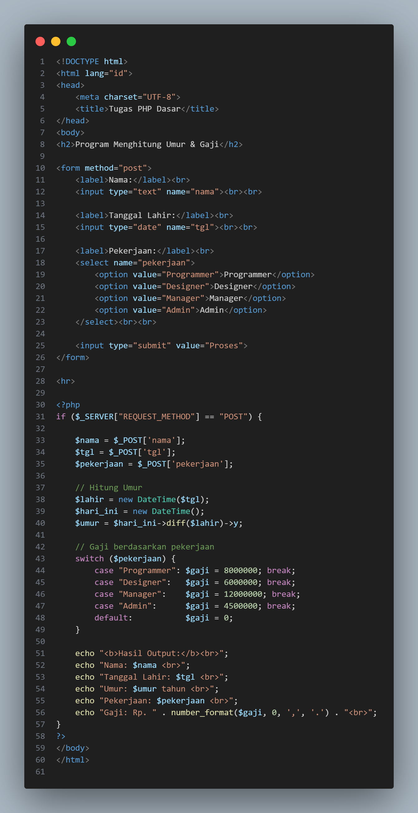
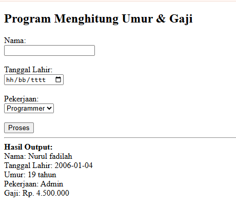

# Praktikum Pemrograman Web - Lab7Web
### Nama: Nurul Fadilah
### NIM: (312410689)
### Kelas: Informatika

## Deskripsi
Program PHP sederhana yang menggunakan form input untuk menampilkan:
- Nama  
- Tanggal Lahir  
- Pekerjaan  

Program ini juga menghitung umur dan menampilkan gaji berdasarkan pekerjaan yang dipilih menggunakan logika kondisi switch.

## Langkah-langkah
1. Membuat form input menggunakan elemen <form>, <input>, dan <select>.  
2. Mengambil data dengan metode POST.  
3. Menghitung umur berdasarkan tanggal lahir dengan date_diff.  
4. Menentukan gaji sesuai pekerjaan menggunakan switch.  
5. Menampilkan hasil output di halaman yang sama.  
6. Melakukan commit hasil kerja ke repository GitHub.

## Hasil Screenshot
Berikut adalah beberapa tampilan hasil dari program PHP:

### 💻 Tampilan Kode Program

### 🧾 Hasil Output Program

> *Catatan:*  
> Pastikan file gambar code.png dan hasil.png disimpan di folder yang sama dengan README.md agar tampil di GitHub.